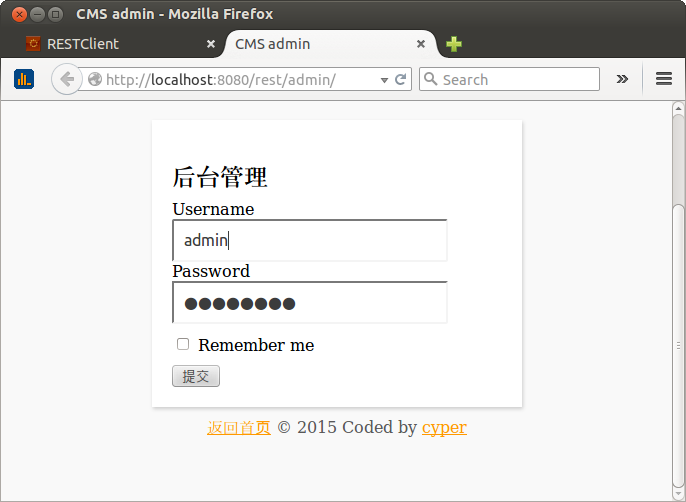

# Spring 4 learning project
This project will demo the techniques that would be used in our project. This version 1 will be just a general-purpose website (I call it `bare version`), it has a front-end and a back-end, the backend requires login. The documentation is in another project, it's just my personal learning notes.

###Todo
1. ~~Web services security~~(done)
2. ~~Asked one question on [stackoverflow](http://stackoverflow.com/questions/28413070/in-spring-mvc-4-1-is-there-any-nonresponsebody-to-return-a-normal-view)~~ (replied)
3. ~~RESTful CRUD (@RestController in Spring4.x)~~(done)
3. ~~Slf4j + Log4j~~(done)
4. Error handling(ongoing)
3. what's the difference between ctx-annotation-config and mvc-annotation-driven(reading)
3. i18n: MessageSourceAware
3. A simple Android native client consuming RESTful service.(reading a book)
4. A hybrid mobile client consuming RESTful service(learning).

###How to setup
1. Get the code
`git clone https://github.com/uniquejava/spring4_rest.git`

2. Open project in eclipse, the maven plugin should automatically download the required jars.
>Also you can open this project in IDEA but ensure you right click on the pom.xml and mark this project as a Maven project.

3. Run script `doc/sql/mysql.sql`
4. Deploy to Tomcat

5. Open in browser: http://localhost:8080/rest/

###Notes on Eclipse
When you run this project in Eclipse, you may encounter below exceptions.

java.lang.ClassNotFoundException: org.springframework.web.servlet.DispatcherServlet

The solution is very simple, you just need to add the "Maven Dependency" in the Deployement Assembly

    right click on your project and choose properties.
    click on Deployement Assembly.
    click add
    click on "Java Build Path Entries"
    select Maven Dependencies"
    click Finish.

That's it!! rebuild and deploy again

###Components
1. spring 4.1.4
2. jackson 2.5
1. ~~bootstrap-3.3.2~~
2. jquery-1.11.2

###Roadmap
Bare version will be proactive and will demo/use the latest techniques if i am happy.

General version would be done if i have time.

Corporation version is for internal use and close source.

`Bare`:
* i18n
* cluster
* excel, odf, pdf
* jpa
* cache

`General`
* bootstrap3.3.2
* kindeditor

`Corporation`:
* [V18](https://github.com/ibmmxlabs/v18) integeration

###Environment
Here is the environment I am working on.

1. Ubuntu12.04.5 LTS
2. Eclipse JEE 4.3
3. Tomcat 7.0.57
4. JDK1.6.0_45

However, this project is fully tested on Win7 + WAS8.5

