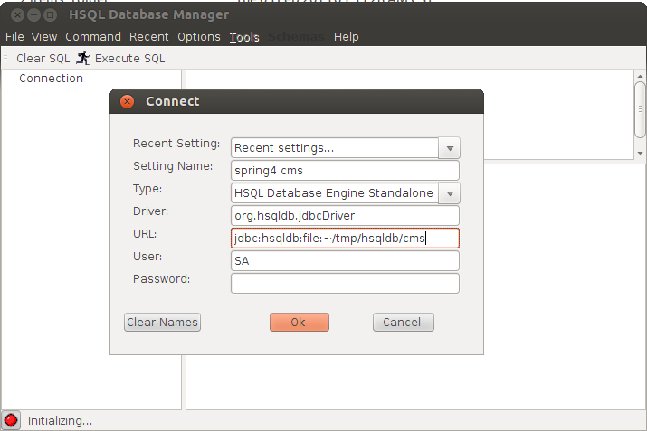

###Setup Database
Type `cd PROJECT_HOME/doc/sql`, there are several sql files each for a specific database, you can choose any database below (default is MySQL).

make sure you uncomment the db driver part in `pom.xml` so that jars could be downloaded.

####MySQL 5.x
MySQL is the default DB, recommended version is 5.5.42, on windows
you can install `mysql-5.5.42-winx64.msi` (size: 42M)

	mysql -V
	mysql -uroot -p123456 #root is user name, 123456 is your password
	source mysql.sql
	source data.sql

Or you can use `mysql -u user_name -h localhost -p db_name < file_name.sql`.

####DB2 10.x
If you choose to use DB2, assume the database name is `cms`, the user and schema both are `db2inst1`,
type the following command to setup the database:

    su db2inst1 #this line is only required on ubuntu
    db2start
    db2 "create database cms USING CODESET UTF-8 TERRITORY CN pagesize 32 K"
    db2 connect to cms
    db2 -t -f db2.sql
    db2 -t -f data.sql

Note create database part(the 3rd line) is not required if you've already created the database.

####HSQLDB 2.X
hsqldb manual: http://hsqldb.org/web/hsqlDocsFrame.html

Note the sql for DB2 and HSQLDB are exactly the same.

You dont' need to create a database for HSQLDB, specify a path and it's created on the fly.

launch GUI: `java -cp hsqldb-2.3.2.jar org.hsqldb.util.DatabaseManagerSwing`, and execute the SQL in the UI interface.

####DB2 and HSQLDB DIFFERENCE
1. date(t.last_upt_time) -> cast(last_upt_time as date)
2. fetch first 1 row only -> fetch 1 row only
3. HSQLDB:  default xyz then not null.(not null default xyz wont' work)

db2 and hsqldb both support cast(), db2 supports date(), hsqldb doesn't require keyword first.
